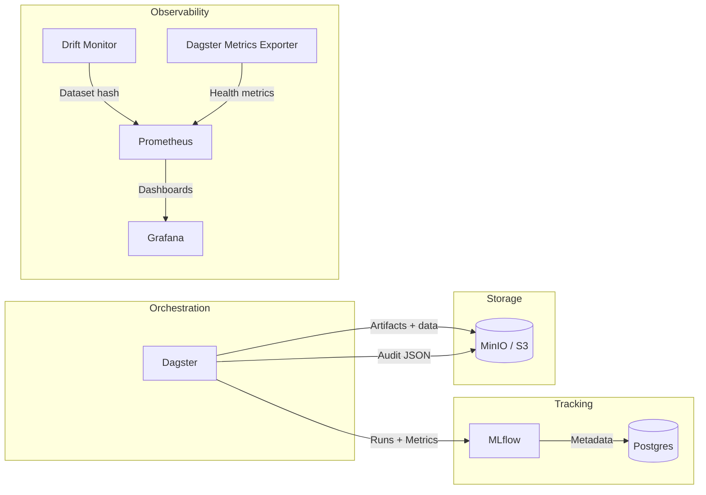

# MLOps Platform Skeleton

End-to-end, Dockerized MLOps environment that demonstrates how data scientists can self-serve ingestion, training, experiment tracking, governance, and observability. This repo emphasizes platform engineering practices—automation, guardrails, and cloud-ready design—over ML modeling.

## Table of Contents

1. [Architecture](#architecture)
2. [Features](#features)
3. [Stack Components](#stack-components)
4. [Getting Started](#getting-started)
5. [Running the ML Pipeline](#running-the-ml-pipeline)
6. [Governance, Security & Guardrails](#governance-security--guardrails)
7. [Observability & Alerting](#observability--alerting)
8. [Infrastructure-as-Code & Autoscaling](#infrastructure-as-code--autoscaling)
9. [Repository Layout](#repository-layout)
10. [Standards & Contribution Guidelines](#standards--contribution-guidelines)

---

## Architecture



**Trade-offs & evolution**

- Dagster chosen for modern Python-native DAG authoring and ML-friendly ops; Dagster can scale out via ECS/EKS (see [Autoscaling plan](#infrastructure-as-code--autoscaling)).
- MLflow provides experiment tracking, registry, and governance tags; can be extended with automated approval workflows.
- MinIO/Postgres mimic cloud services locally; in production swap for Amazon S3 + Aurora Serverless.
- Guardrails (RBAC, audit logs, drift detection) satisfy regulated ML requirements and provide hooks for additional policy enforcement.

---

## Features

- **Self-service orchestration**: Dagster job & schedule for ingestion → validation → training → registry.
- **Experiment tracking**: MLflow run metadata, artifacts, and model registration with governance tags.
- **Governance**: Role-aware guardrails, audit events streamed to MinIO/S3, deployment blocking outside dev.
- **Observability**: Prometheus + Grafana dashboards, drift monitoring, alerting rules, synthetic service exporters.
- **IaC ready**: Terraform skeleton + autoscaling blueprint for ECS/Fargate, Batch, and Aurora.
- **Single-command spin up**: Docker Compose and helper scripts orchestrate the entire stack.

---

## Stack Components

| Service | Purpose | Ports | Notes |
|---------|---------|-------|-------|
| Dagster | Orchestrates ingestion/validation/training/register steps | `3000` | Mounts `pipelines/` and `data/` for live editing |
| MLflow | Tracking server & model registry | `5000` | Serves Prometheus metrics via `--expose-prometheus` |
| Postgres | Metadata DB for MLflow/Dagster | `5432` | Data persisted via `postgres_data` volume |
| MinIO | S3-compatible artifact store | `9000/9001` | Buckets auto-created (`DATA_BUCKET`, `ARTIFACT_BUCKET`, `AUDIT_BUCKET`) |
| Prometheus | Metrics scrape + alerting | `9090` | Config in `prometheus.yml`, alerts in `alert_rules.yml` |
| Grafana | Dashboards & visualization | `3030` | Dashboards auto-provisioned from `grafana/dashboards/` |
| Drift monitor | Synthetic data drift check | `9100` | Emits `synthetic_data_*` metrics |
| Dagster metrics exporter | Health probe → Prometheus metrics | `9200` | Exposes `dagster_webserver_up`, response latency |

---

## Getting Started

1. **Prerequisites**
   - Docker + Docker Compose
   - macOS/Linux with `bash`

2. **Configure environment**
   ```bash
   cp .env.example .env
   # Customize secrets, bucket names, governance variables, baseline hash, etc.
   ```

3. **Install helper dependencies (optional)**
   - `python3` for local scripts
   - `terraform` (if exploring IaC)
   - `uv` is baked into the Dagster container for dependency resolution and CLI execution; you don’t need it on the host unless you want to run Dagster locally.

4. **Launch the stack**
   ```bash
   # First-time build (or whenever dependencies change)
   ./scripts/build-all.sh

   # Alternatively, use Docker Compose directly
   docker compose up -d --build
   ```

5. **Verify services**
   - Dagster UI: http://localhost:3000
   - MLflow UI: http://localhost:5000
   - MinIO console: http://localhost:9001
   - Grafana: http://localhost:3030 (login `admin` / password from `.env`)
   - Prometheus targets: http://localhost:9090/targets

6. **Tear down**
   ```bash
   ./scripts/decommission.sh  # or docker compose down -v
   ```

---

## Running the ML Pipeline

1. **Data**
   - Sample CSV located at `data/sample_data.csv`. Ensure the file is mounted into Dagster (`./data:/opt/dagster/app/data`).

2. **Trigger a run**
   - Use Dagster UI → `ml_training_pipeline` → “Launch Run”.
   - Or CLI: `docker compose exec dagster uv run dagster job launch -f pipelines/ml_pipeline.py -j ml_training_pipeline`.

3. **What happens**
   - `ingest_data`: reads local CSV, uploads to MinIO, logs dataset hash.
   - `validate_data`: simple null/row count checks.
   - `train_model`: mock metrics + artifact logged to MLflow; governance guardrails enforce role/environment.
   - `register_with_governance`: registers model version, sets approval tags, emits asset materialization.

4. **Schedules**
   - `ml_training_schedule` runs every 6 hours (configurable via `ScheduleDefinition`).
   - Extend with sensors or jobs as needed.

5. **Inspect results**
   - MLflow UI → Models → `CreditRiskModel` → verify tags (`owner`, `environment`, `approval_state`, etc.).
   - MinIO → `governance/audit/` prefix → JSON audit entries per step/run.
   - Grafana → “MLOps Observability” dashboard (auto-provisioned) for health/drift metrics.

---

## Governance, Security & Guardrails

Implemented in `pipelines/ml_pipeline.py`:

- **Environment-aware RBAC**: `RUN_ROLE`, `ENVIRONMENT`, `ALLOWED_*_ROLES` env vars block runs in staging/prod unless authorized.
- **Audit logging**: every op logs structured JSON (owner, timestamp, status, metadata) to MinIO (`AUDIT_BUCKET/AUDIT_LOG_PREFIX`). This satisfies audit trail requirements and can be ingested into downstream systems.
- **Model tagging**: MLflow model versions receive `approval_state`, `data_hash`, `audit_owner`, `audit_env`, `audit_timestamp`, `deployment_blocked`.
- **Policy stubs**: Tag `deployment_blocked=true` outside dev; integrate with CI/CD gates or approval workflows before promoting versions.
- **Data drift guardrails**: `monitoring/drift_monitor.py` continuously hashes datasets and raises alerts if they diverge from `BASELINE_DATA_HASH`.

Configuration lives in `.env` and `.env.example`. Update `RUN_OWNER`, `RUN_ROLE`, `ENVIRONMENT`, and baseline hashes per environment.

---

## Observability & Alerting

- **Prometheus** (`prometheus.yml`)
  - Scrapes: Dagster exporter, MLflow, MinIO, drift monitor, Prometheus itself.
  - Loads alert rules from `alert_rules.yml` (service down, drift detected, stale drift monitor).
- **Grafana**
  - Dashboards auto-provisioned from `grafana/dashboards/mlops-observability.json`.
  - `PROM_DS` variable points at the Prometheus datasource; panels cover service availability, drift status, MLflow latency, row counts, etc.
- **Metrics exporters**
  - `dagster-metrics` container checks Dagster health endpoint and exposes gauges for Prometheus.
  - `drift-monitor` emits dataset hash comparisons and row counts.
- **Alert routing**
  - Extend Prometheus config with Alertmanager endpoints or integrate Grafana alerting as needed.
- **Monitoring scripts**
  - Add custom exporters under `monitoring/` for additional services (e.g., batch jobs, MinIO health).

---

## Infrastructure-as-Code & Autoscaling

- Terraform skeleton: `infrastructure/terraform/main.tf`
  - Defines VPC, subnets, S3 buckets, IAM role/policy, Aurora stub, ECS cluster, CloudWatch log group.
  - Run `terraform init && terraform plan` to preview.
- Autoscaling blueprint: `docs/autoscaling.md`
  - Describes ECS/Fargate deployment for Dagster/MLflow, AWS Batch for training burst capacity, Aurora Serverless, and CloudWatch-based scaling signals.
  - Includes Terraform snippets for ECS services + auto scaling targets; outlines network separation and multi-account strategy.
- Production evolution:
  - Replace MinIO/Postgres with AWS managed services.
  - Deploy Prometheus/Grafana via AMP/AMG or EKS with HPA.
  - Integrate CI/CD (GitHub Actions, AWS CodePipeline) to build/push images to ECR and apply Terraform per environment.

---

## Repository Layout

```
.
├── docker-compose.yml         # Orchestrates all services
├── docker/                    # Service-specific Dockerfiles
├── pipelines/ml_pipeline.py   # Dagster job + governance logic
├── monitoring/                # Auxiliary exporters (drift, dagster health)
├── grafana/                   # Provisioned dashboards & configs
├── prometheus.yml             # Prometheus scrape config
├── alert_rules.yml            # Prometheus alert rules
├── infrastructure/terraform/  # IaC skeleton for AWS
├── data/                      # Sample dataset (mounted into Dagster)
├── scripts/                   # Helper build/rebuild/teardown scripts
├── docs/autoscaling.md        # Scaling plan and guidance
└── README.md                  # (This document)
```

---

## Standards & Contribution Guidelines

1. **Environment configuration**
   - Store secrets in `.env` (not committed). Mirror changes in `.env.example`.
   - Keep governance variables (`RUN_ROLE`, `AUDIT_BUCKET`, `BASELINE_DATA_HASH`) up to date per environment.

2. **Coding standards**
   - Python: prefer type hints and descriptive logging. Keep business logic in `pipelines/` modules.
   - Terraform: follow module-friendly structure when expanding beyond the stub; annotate security groups and scaling policies.
   - Dockerfiles: pin base images (already on Python 3.11-slim) and keep build steps minimal. Dependencies are installed via [Astral’s `uv`](https://github.com/astral-sh/uv); use `uv run ...` when executing CLIs inside containers.

3. **Testing & validation**
   - After modifying pipelines, run `docker compose restart dagster` and relaunch `ml_training_pipeline`.
   - For monitoring changes, restart Prometheus/Grafana and check http://localhost:9090/targets.
   - Validate governance by running with different `ENVIRONMENT` / `RUN_ROLE` combinations (prod role mismatch should fail).

4. **Documentation**
   - Update this README when adding services, dashboards, or workflows.
   - Extend `docs/` with additional design notes (e.g., CI/CD plan, security hardening).

5. **Optional artifacts**
   - AI prompt log, architecture diagrams, or recorded demos can be stored in `docs/` for interview follow-up.

---

## License

This project is provided as an template. Adapt or extend it for your organization’s needs.
